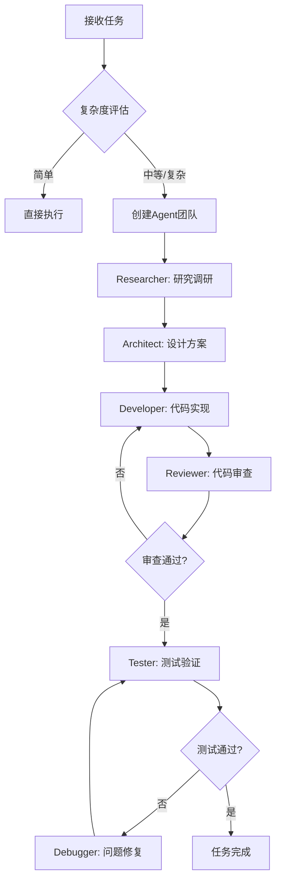

# 🤖 多Agent协作技能 (Multi-Agent Collaboration Skill)

## 📢 调用提示

**在每次对话开始或接收新任务时，请使用以下方式调用此技能：**

```
/multi-agent
```

或者明确指示：
```
请使用多Agent模式来完成这个任务
```

---

## 🎯 技能目标

在执行任何复杂任务之前，自动判断是否需要创建多Agent系统，确保任务以最高效、最全面的方式完成。

---

## 📋 执行流程

### 第一步：任务评估

在收到任何任务时，首先进行以下评估：

1. **任务复杂度判断**
   - 简单任务（单一文件修改、简单问答）→ 直接执行，无需多Agent
   - 中等任务（多文件修改、需要研究）→ 考虑使用2-3个Agent
   - 复杂任务（系统架构、多阶段开发）→ 必须使用完整多Agent系统

2. **任务类型识别**
   - 开发类：需要 Researcher + Developer + Reviewer
   - 调试类：需要 Debugger + Analyzer + Tester
   - 设计类：需要 Architect + Designer + Validator
   - 文档类：需要 Researcher + Writer + Editor

### 第二步：Agent创建检查

检查当前会话中是否已经定义了Agent角色：

```markdown
## 已创建的Agent检查清单

- [ ] Researcher Agent（研究员）
- [ ] Developer Agent（开发者）
- [ ] Reviewer Agent（审查员）
- [ ] Architect Agent（架构师）
- [ ] Tester Agent（测试员）
- [ ] Debugger Agent（调试员）
```

如果未创建，则根据任务需求创建相应的Agent。

### 第三步：Agent角色定义

根据任务需要，从以下预定义角色中选择创建：

---

#### 🔍 Researcher Agent（研究员）
**职责：** 信息收集、文档研究、最佳实践调研
**能力：**
- 使用 `search_web` 搜索最新技术方案
- 使用 `mcp_context7_query-docs` 查询官方文档
- 阅读和分析代码库中的现有实现
- 生成研究报告和建议

**输出格式：**
```markdown
## 研究报告
### 主题：[研究主题]
### 发现：
1. [发现1]
2. [发现2]
### 推荐方案：
- [方案描述]
### 参考资料：
- [链接/来源]
```

---

#### 💻 Developer Agent（开发者）
**职责：** 代码实现、功能开发、代码优化
**能力：**
- 编写符合项目规范的代码
- 使用 `write_to_file` 创建新文件
- 使用 `replace_file_content` 修改现有代码
- 遵循最佳实践和设计模式

**输出格式：**
```markdown
## 开发报告
### 实现功能：[功能名称]
### 修改文件：
- [文件路径]: [修改说明]
### 代码变更摘要：
[变更描述]
### 后续工作：
- [待办事项]
```

---

#### 📝 Reviewer Agent（审查员）
**职责：** 代码审查、质量保证、问题发现
**能力：**
- 审查代码质量和风格
- 检查潜在的bug和安全问题
- 验证代码符合项目规范
- 提供改进建议

**输出格式：**
```markdown
## 代码审查报告
### 审查范围：[文件/功能]
### 问题发现：
- 🔴 严重：[问题描述]
- 🟡 警告：[问题描述]
- 🟢 建议：[改进建议]
### 总体评价：
[评价和建议]
```

---

#### 🏗️ Architect Agent（架构师）
**职责：** 系统设计、架构规划、技术选型
**能力：**
- 设计系统架构和模块划分
- 制定技术选型方案
- 规划API接口和数据模型
- 评估技术可行性

**输出格式：**
```markdown
## 架构设计文档
### 系统概述：
[系统描述]
### 架构图：
[Mermaid图或描述]
### 模块划分：
1. [模块1]: [职责]
2. [模块2]: [职责]
### 技术选型：
- [技术]: [选择理由]
```

---

#### 🧪 Tester Agent（测试员）
**职责：** 测试设计、测试执行、结果验证
**能力：**
- 设计测试用例和测试场景
- 执行单元测试和集成测试
- 使用 `run_command` 运行测试命令
- 验证功能正确性

**输出格式：**
```markdown
## 测试报告
### 测试范围：[测试内容]
### 测试用例：
| 用例ID | 描述 | 预期结果 | 实际结果 | 状态 |
|--------|------|----------|----------|------|
| TC01   | ...  | ...      | ...      | ✅/❌ |
### 测试覆盖率：[百分比]
### 发现问题：
- [问题描述]
```

---

#### 🐛 Debugger Agent（调试员）
**职责：** 问题诊断、错误修复、根因分析
**能力：**
- 分析错误日志和堆栈跟踪
- 定位问题根本原因
- 设计并实施修复方案
- 验证修复有效性

**输出格式：**
```markdown
## 调试报告
### 问题描述：
[问题现象]
### 根因分析：
[原因分析]
### 修复方案：
[修复步骤和代码变更]
### 验证结果：
[验证过程和结果]
```

---

## 🔄 多Agent协作流程

### 标准开发任务流程



### Agent间通信协议

每个Agent完成任务后，必须输出结构化报告，包含：
1. **执行摘要**：这个Agent做了什么
2. **输出产物**：产生了什么结果
3. **下一步建议**：建议后续Agent做什么
4. **潜在风险**：发现的可能问题

---

## 💡 使用示例

### 示例1：开发新功能

```
用户：帮我实现一个用户认证系统

多Agent响应：
1. 🔍 Researcher: 研究JWT和OAuth2.0最佳实践
2. 🏗️ Architect: 设计认证系统架构
3. 💻 Developer: 实现认证逻辑和API
4. 📝 Reviewer: 审查代码安全性
5. 🧪 Tester: 测试认证流程
```

### 示例2：修复Bug

```
用户：登录功能报错，请帮我修复

多Agent响应：
1. 🐛 Debugger: 分析错误日志，定位问题
2. 💻 Developer: 实施修复方案
3. 🧪 Tester: 验证修复效果
```

### 示例3：代码重构

```
用户：请重构这个模块的代码

多Agent响应：
1. 🔍 Researcher: 分析现有代码结构
2. 🏗️ Architect: 规划重构方案
3. 💻 Developer: 执行重构
4. 📝 Reviewer: 确保质量不降低
5. 🧪 Tester: 验证功能完整性
```

---

## ⚙️ 配置选项

可以通过以下方式自定义多Agent行为：

```markdown
## 自定义配置

### 默认Agent组合
- 开发任务：Researcher + Developer + Reviewer
- 调试任务：Debugger + Developer + Tester
- 设计任务：Researcher + Architect + Reviewer

### 迭代次数限制
- 最大迭代：3次
- 每次迭代后需要进度报告

### 质量标准
- 代码审查必须通过
- 测试覆盖率 > 80%
- 无严重安全问题
```

---

## 📌 注意事项

1. **适度使用**：简单任务不需要启用多Agent模式
2. **保持焦点**：每个Agent专注于自己的职责
3. **迭代改进**：根据反馈持续优化Agent协作
4. **文档记录**：重要决策和变更需要记录

---

## 🚀 快速开始

在新对话中使用此技能：

```
我需要[描述任务]，请使用多Agent模式来完成
```

或简单地说：

```
/multi-agent [任务描述]
```

系统将自动：
1. ✅ 评估任务复杂度
2. ✅ 选择合适的Agent组合
3. ✅ 按流程执行任务
4. ✅ 提供结构化的完成报告
